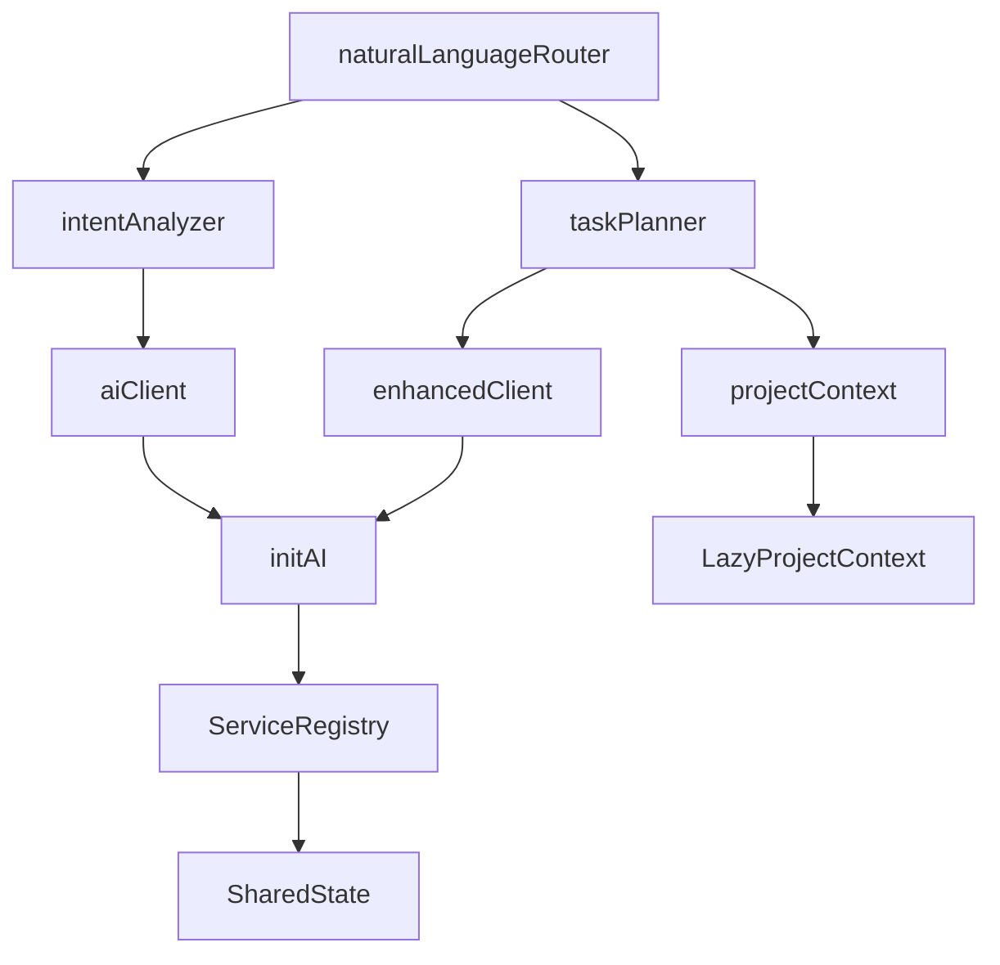

# Circular Dependency Fix Proposal

## Problem Analysis

### Current Issue
The `naturalLanguageRouter` initialization in the ComponentFactory is causing a "Maximum call stack size exceeded" error. While we fixed the direct circular dependencies by removing recursive `getComponent` calls, there's a deeper architectural issue.

### Root Cause Analysis

1. **Initialization Order Problem**
   - `getAIClient()` and `getEnhancedClient()` require `initAI()` to be called first
   - `initAI()` itself initializes multiple components including ProjectContext and EnhancedClient
   - The ComponentFactory tries to create these components independently, causing conflicts

2. **Shared State Issue**
   - Multiple components create their own instances of `LazyProjectContext`
   - No shared instance management, leading to duplicate initialization
   - Each component initialization may trigger AI client initialization multiple times

3. **Dependency Graph**
```
naturalLanguageRouter
├── intentAnalyzer
│   └── aiClient (requires initAI)
├── taskPlanner
│   ├── enhancedClient (requires initAI)
│   └── projectContext (duplicate instance)
└── [internal dependencies may cause recursion]
```

## Proposed Solution

### Architecture Changes

#### 1. **Singleton Pattern for Core Services**
Create a centralized service registry that ensures single instances of core components.

```typescript
// src/interactive/service-registry.ts
export class ServiceRegistry {
  private static instance: ServiceRegistry;
  private services = new Map<string, any>();
  private initPromises = new Map<string, Promise<any>>();

  static getInstance(): ServiceRegistry {
    if (!ServiceRegistry.instance) {
      ServiceRegistry.instance = new ServiceRegistry();
    }
    return ServiceRegistry.instance;
  }

  async getService<T>(name: string, factory: () => Promise<T>): Promise<T> {
    // Return existing service if available
    if (this.services.has(name)) {
      return this.services.get(name);
    }

    // Return existing initialization promise if in progress
    if (this.initPromises.has(name)) {
      return this.initPromises.get(name);
    }

    // Initialize service
    const initPromise = factory();
    this.initPromises.set(name, initPromise);

    try {
      const service = await initPromise;
      this.services.set(name, service);
      this.initPromises.delete(name);
      return service;
    } catch (error) {
      this.initPromises.delete(name);
      throw error;
    }
  }
}
```

#### 2. **Lazy Initialization Wrapper**
Create wrapper functions that handle initialization state properly.

```typescript
// src/interactive/lazy-initializers.ts
export class LazyInitializers {
  private static aiInitialized = false;
  private static aiInitPromise: Promise<void> | null = null;

  static async ensureAIInitialized(): Promise<void> {
    if (this.aiInitialized) return;

    if (!this.aiInitPromise) {
      this.aiInitPromise = initAI().then(() => {
        this.aiInitialized = true;
      });
    }

    await this.aiInitPromise;
  }

  static async getAIClientLazy(): Promise<OllamaClient> {
    await this.ensureAIInitialized();
    return getAIClient();
  }

  static async getEnhancedClientLazy(): Promise<EnhancedClient> {
    await this.ensureAIInitialized();
    return getEnhancedClient();
  }
}
```

#### 3. **Refactor ComponentFactory**
Update the ComponentFactory to use the service registry and lazy initializers.

```typescript
// Updated src/interactive/component-factory.ts
private async createComponentInternal<T>(type: ComponentType): Promise<T> {
  const registry = ServiceRegistry.getInstance();

  switch (type) {
    case 'aiClient':
      return registry.getService('aiClient',
        () => LazyInitializers.getAIClientLazy()) as Promise<T>;

    case 'enhancedClient':
      return registry.getService('enhancedClient',
        () => LazyInitializers.getEnhancedClientLazy()) as Promise<T>;

    case 'projectContext':
      return registry.getService('projectContext', async () => {
        const context = new LazyProjectContext(process.cwd());
        return context;
      }) as Promise<T>;

    case 'intentAnalyzer':
      return registry.getService('intentAnalyzer', async () => {
        const aiClient = await this.getComponent<OllamaClient>('aiClient');
        return new EnhancedIntentAnalyzer(aiClient);
      }) as Promise<T>;

    case 'taskPlanner':
      return registry.getService('taskPlanner', async () => {
        const [enhancedClient, projectContext] = await Promise.all([
          this.getComponent<any>('enhancedClient'),
          this.getComponent<ProjectContext>('projectContext')
        ]);
        return new TaskPlanner(enhancedClient, projectContext);
      }) as Promise<T>;

    case 'naturalLanguageRouter':
      return registry.getService('naturalLanguageRouter', async () => {
        const [intentAnalyzer, taskPlanner] = await Promise.all([
          this.getComponent<any>('intentAnalyzer'),
          this.getComponent<any>('taskPlanner')
        ]);
        return new NaturalLanguageRouter(intentAnalyzer, taskPlanner);
      }) as Promise<T>;

    // ... other components
  }
}
```

#### 4. **Component Initialization State Machine**
Implement a proper state machine for component initialization.

```typescript
// src/interactive/initialization-state.ts
export enum InitState {
  NOT_STARTED = 'not_started',
  INITIALIZING = 'initializing',
  READY = 'ready',
  FAILED = 'failed'
}

export class InitializationStateMachine {
  private states = new Map<ComponentType, InitState>();
  private errors = new Map<ComponentType, Error>();

  getState(component: ComponentType): InitState {
    return this.states.get(component) || InitState.NOT_STARTED;
  }

  setState(component: ComponentType, state: InitState, error?: Error): void {
    this.states.set(component, state);
    if (error) {
      this.errors.set(component, error);
    }
  }

  canInitialize(component: ComponentType, dependencies: ComponentType[]): boolean {
    // Check if all dependencies are ready
    return dependencies.every(dep =>
      this.getState(dep) === InitState.READY
    );
  }
}
```

## Implementation Plan

### Phase 1: Core Infrastructure (2 hours)
1. Create `ServiceRegistry` class
2. Create `LazyInitializers` class
3. Create `InitializationStateMachine` class
4. Add comprehensive logging for debugging

### Phase 2: Refactor ComponentFactory (2 hours)
1. Update all component creation methods to use ServiceRegistry
2. Implement proper dependency ordering
3. Add initialization state tracking
4. Add timeout and retry logic

### Phase 3: Testing & Validation (2 hours)
1. Unit tests for ServiceRegistry
2. Integration tests for ComponentFactory
3. End-to-end tests for interactive mode startup
4. Performance benchmarks

### Phase 4: Documentation (1 hour)
1. Update architecture documentation
2. Add troubleshooting guide
3. Document new initialization flow

## Benefits

1. **Eliminates Circular Dependencies**: Centralized service management prevents circular initialization
2. **Improved Performance**: Shared instances reduce duplicate initialization
3. **Better Error Handling**: Clear initialization states and error tracking
4. **Maintainability**: Cleaner separation of concerns and dependency management
5. **Debugging**: Comprehensive logging and state tracking

## Risks & Mitigation

### Risk 1: Breaking Changes
**Mitigation**: Keep backward compatibility by maintaining the existing ComponentFactory interface

### Risk 2: Performance Impact
**Mitigation**: Use lazy initialization and caching to maintain performance gains

### Risk 3: Complex State Management
**Mitigation**: Implement comprehensive logging and debugging tools

## Testing Strategy

### Unit Tests
```typescript
describe('ServiceRegistry', () => {
  test('should return same instance for multiple calls', async () => {
    const registry = ServiceRegistry.getInstance();
    const factory = jest.fn().mockResolvedValue({ test: 'value' });

    const result1 = await registry.getService('test', factory);
    const result2 = await registry.getService('test', factory);

    expect(result1).toBe(result2);
    expect(factory).toHaveBeenCalledTimes(1);
  });

  test('should handle concurrent initialization', async () => {
    const registry = ServiceRegistry.getInstance();
    const factory = jest.fn().mockImplementation(
      () => new Promise(resolve => setTimeout(() => resolve({ test: 'value' }), 100))
    );

    const [result1, result2] = await Promise.all([
      registry.getService('test2', factory),
      registry.getService('test2', factory)
    ]);

    expect(result1).toBe(result2);
    expect(factory).toHaveBeenCalledTimes(1);
  });
});
```

### Integration Tests
```typescript
describe('ComponentFactory with ServiceRegistry', () => {
  test('should initialize naturalLanguageRouter without circular dependency', async () => {
    const factory = new ComponentFactory();

    const nlRouter = await factory.getComponent('naturalLanguageRouter', {
      timeout: 5000
    });

    expect(nlRouter).toBeDefined();
    expect(nlRouter).toHaveProperty('route');
  });
});
```

## Rollback Plan

If issues arise:
1. Set `OLLAMA_USE_LEGACY_INIT=true` environment variable
2. Revert to previous ComponentFactory implementation
3. Use fallback mode in production while fixing issues

## Success Metrics

1. **Zero Stack Overflow Errors**: No circular dependency errors
2. **Startup Time < 3s**: Maintain performance improvements
3. **95%+ Success Rate**: Reliable initialization
4. **Memory Usage < 70MB**: Efficient resource utilization

## Timeline

- **Day 1**: Implement core infrastructure (ServiceRegistry, LazyInitializers)
- **Day 2**: Refactor ComponentFactory and test
- **Day 3**: Integration testing and documentation
- **Day 4**: Deploy to staging and monitor
- **Day 5**: Production rollout with monitoring

## Approval

This proposal requires approval from:
- [ ] Technical Lead
- [ ] QA Team
- [ ] DevOps Team

## Appendix: Dependency Graph



## Next Steps

1. Review and approve this proposal
2. Create feature branch `fix/circular-dependency`
3. Implement Phase 1 infrastructure
4. Continue with phased implementation
5. Thorough testing before merge

---

**Author**: Assistant
**Date**: 2024-09-28
**Status**: Proposal
**Priority**: High
**Impact**: Critical for interactive mode stability